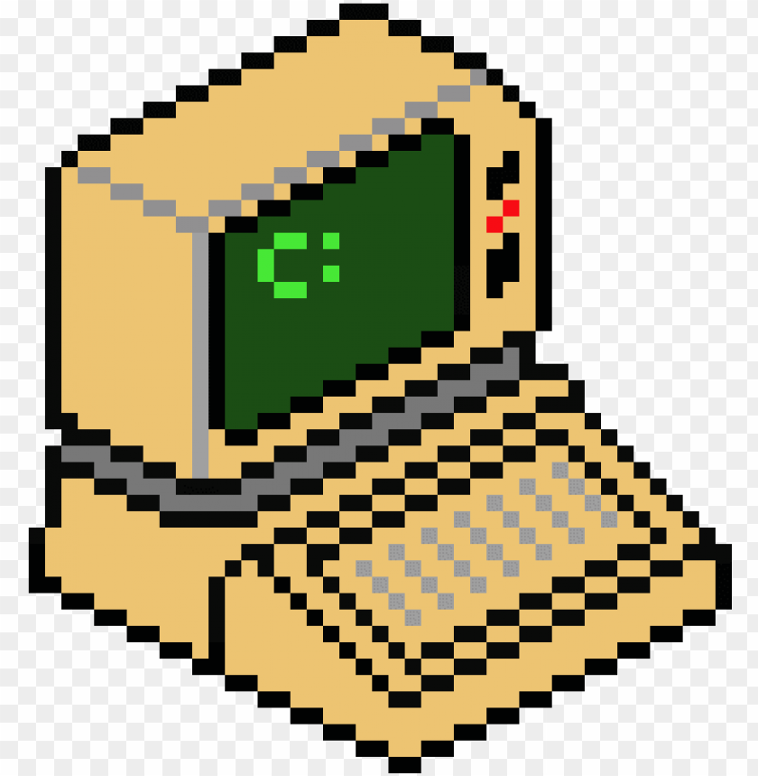

<!-- PROJECT LOGO -->
 

  

  <h3 align="center">FOS</h3>

  

A mighty mini-operating system!
  

<!-- TABLE OF CONTENTS -->

  
Table of Contents

  <ol>
    <li>
      <a href="#about-the-project">About The Project</a>
      <ul>
        <li><a href="#team">The Team</a></li>
      </ul>
    </li>
    <li>
      <a href="#modules">Modules</a>
      <ul>
        <li><a href="#system-calls">System calls</a></li>
        <li><a href="#memory-manager"> Memory manager</a></li>        
        <li><a href="#fault-handler">Fault Handler</a></li>
        <li><a href="#cpu-scheduler"> CPU Scheduler</a></li>
   </ul>
    </li>
    <li><a href="#acknowledgments">Acknowledgments</a></li>
  </ol>

<!-- ABOUT THE PROJECT -->
## About The Project

FOS is a basic, command-line based operating system.

This was a project for OS'23 course at FCIS, Ain Shams University.

* Supervisor and course lecturer: Dr. Ahmed Salah
* Mentor TA: Dr Rezq Mohammed

  
### Team:
* Amna Ahmed - [@thisisamna](https://github.com/thisisamna) 
* Khira Ebe - [@monaya37](https://github.com/monaya37) 
* Mariam Reda - [@Mariam428](https://github.com/Mariam428) 
* Fatma Gamal - [@FatmaGG](https://github.com/FatmaGG) 
* Merna Tareq
* Manar Mansy - [@manarmansyy](https://github.com/manarmansyy) 

### Built With
* C

<!-- GETTING STARTED -->
## Modules

### System Calls

- System call implementation
- Linking user side and kernel side functions

### Memory Manager

Managing user and kernel memory using two schemes
- Dynamic (block) allocator
	- Allocation using first fit and best fit strategies
	- Freeing allocated blocks
	- Reallocation using first fit strategy
- Page allocator
	-  Allocating pages 
	- Freeing memory pages
	- Lazy allocation/deallocation in the case of user memory
### Fault Handler
Validate faulted addresses. If valid, handle the fault either through placement and replacement, using one of two schemes:
- FIFO (First in first out)
- LRU (Least recently used)

### CPU Scheduler
- BSD scheduler implementation
-  Environment (process) management
- Clock interrupt handler

<!-- ROADMAP -->
## Known issues

- [ ] Process command
- [ ] Sbrk (negative decrement) and sys_sbrk 
- [ ] Freeing user memory 

<!-- ACKNOWLEDGMENTS -->
## Acknowledgments

Thanks to Dr. Ahmed Salah, Dr. Rezq Mohamed and all TAs who supported this project. 

Your help was invaluable to our team and every team. :)

